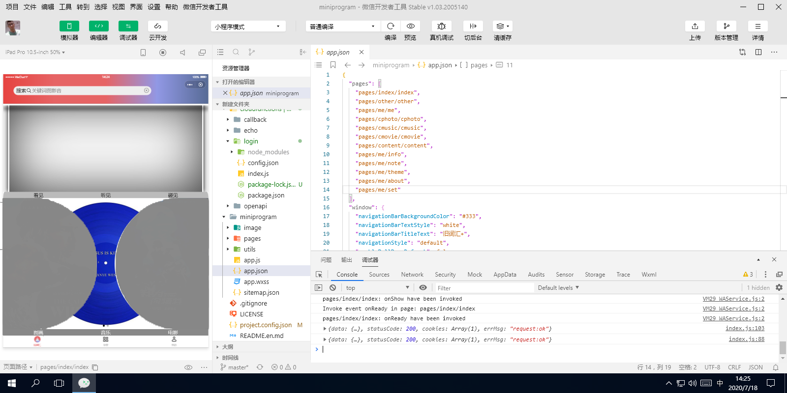

# VocabTranslator

 
词汇翻译小程序  针对学习某一词，大量引用相关的图画解说，音乐歌词和电影字幕。其作用是，让使用者利用虚构的场景（图书音乐电影）及其内容（文本）读懂这单词的含义，更容易地掌握和运用英语词汇。

#### 集成环境

| 编辑器 | 版本 | 平台 |
| :-: | :-: | :-: |
| 微信开发者工具 | v1.03.2005140 | Windows x64 |

#### 重要技术

> _quickstart_  
> 这是云开发的快速启动指引，其中演示了如何上手使用云开发的三大基础能力：
- 数据库：一个既可在小程序前端操作，也能在云函数中读写的 JSON 文档型数据库
- 文件存储：在小程序前端直接上传/下载云端文件，在云开发控制台可视化管理
- 云函数：在云端运行的代码，微信私有协议天然鉴权，开发者只需编写业务逻辑代码

#### [微信官方文档 | 微信开放文档](https://developers.weixin.qq.com/doc/)

#### 软件架构

├─LICENSE `许可证`
***
├─project.config.json `项目配置`
├─miniprogram `小程序`
|      ├─app.js `委托`
|      ├─app.json
|      ├─app.wxss
|      ├─sitemap.json `搜索`
|      ├─utils `工具`
|      |   └util.js
|      ├─pages `页面`
|      |   ├─other `探索`
|      |   |   ├─other.js
|      |   |   ├─other.json
|      |   |   ├─other.wxml
|      |   |   └other.wxss
|      |   ├─me `我的`
|      |   | ├─about.js `关于`
|      |   | ├─about.json
|      |   | ├─about.wxml
|      |   | ├─about.wxss
|      |   | ├─info.js `资料`
|      |   | ├─info.json
|      |   | ├─info.wxml 
|      |   | ├─info.wxss
|      |   | ├─me.js `我的`
|      |   | ├─me.json
|      |   | ├─me.wxml
|      |   | ├─me.wxss
|      |   | ├─note.js `记录`
|      |   | ├─note.json
|      |   | ├─note.wxml
|      |   | ├─note.wxss
|      |   | ├─set.js `设置`
|      |   | ├─set.json
|      |   | ├─set.wxml
|      |   | ├─set.wxss
|      |   | ├─theme.js `主题`
|      |   | ├─theme.json
|      |   | ├─theme.wxml
|      |   | └theme.wxss
|      |   ├─index `主页`
|      |   |   ├─index.js
|      |   |   ├─index.json
|      |   |   ├─index.wxml
|      |   |   └index.wxss
|      |   ├─cphoto `图画`
|      |   |   ├─cphoto.js
|      |   |   ├─cphoto.json
|      |   |   ├─cphoto.wxml
|      |   |   └cphoto.wxss
|      |   ├─content `翻译`
|      |   |    ├─content.js
|      |   |    ├─content.json
|      |   |    ├─content.wxml
|      |   |    └content.wxss
|      |   ├─cmusic `音乐`
|      |   |   ├─cmusic.jpg
|      |   |   ├─cmusic.js
|      |   |   ├─cmusic.json
|      |   |   ├─cmusic.wxml
|      |   |   └cmusic.wxss
|      |   ├─cmovie `电影`
|      |   |   ├─cmovie.js
|      |   |   ├─cmovie.json
|      |   |   ├─cmovie.wxml
|      |   |   └cmovie.wxss
|      ├─image `图像资源`
|      |   └...
├─cloudfunctions `云函数`
|       ├─openapi `接口`
|       |    ├─node_modules
|       |    | └...
|       |    ├─config.json
|       |    ├─index.js
|       |    ├─package-lock.json
|       |    └package.json
|       ├─login `登录`
|       |   ├─node_modules
|       |   | └...
|       |   ├─config.json
|       |   ├─index.js
|       |   ├─package-lock.json
|       |   └package.json
|       ├─echo `输出`
|       |  ├─node_modules
|       |  | └...
|       |  ├─config.json
|       |  ├─index.js
|       |  ├─package-lock.json
|       |  └package.json
|       ├─callback `回调`
|       |    ├─node_modules
|       |    | └...
|       |    ├─config.json
|       |    ├─index.js
|       |    ├─package-lock.json
|       |    └package.json

#### 运行结果

#### 安装教程

1.  xxxx
2.  xxxx
3.  xxxx

#### 使用说明

1.  xxxx
2.  xxxx
3.  xxxx

#### 参与贡献

1.  Fork 本仓库
2.  新建 Feat_xxx 分支
3.  提交代码
4.  新建 Pull Request
